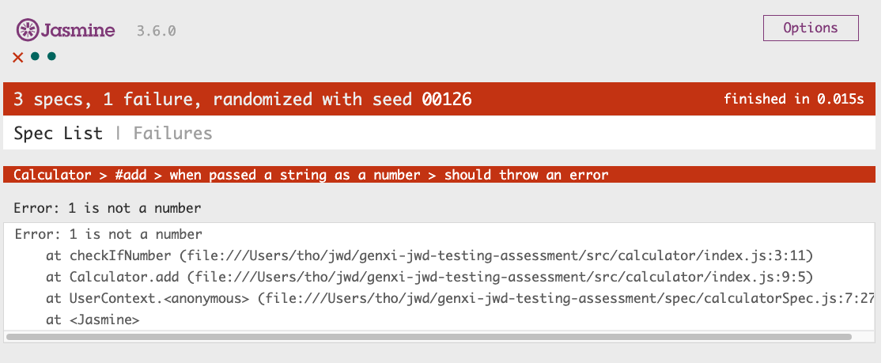
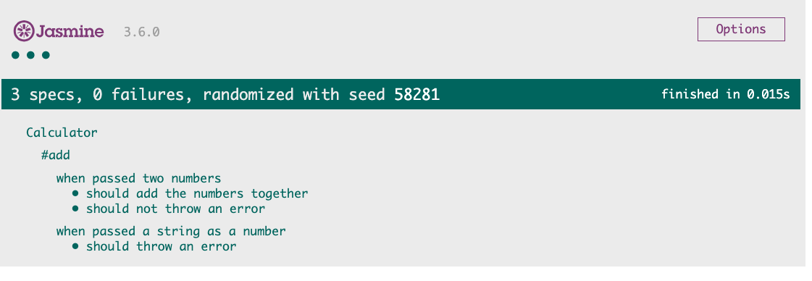

# Testing Exercises 

## Description

Now that you've learnt the basics of testing javascript with Jasmine, `git clone` this repository and get stuck into the exercises!

## Exercises

Each exercise is made up of source code available in the [src/](src/) folder.

To complete each exercise, create a matching `spec` file in the [spec/](spec/) folder, and use a `<script></script>` tag to add it to [SpecRunner.html](SpecRunner.html). The first one, [src/calculator/index.js](src/calculator/index.js), has been done for you.

Make sure to have [SpecRunner.html](SpecRunner.html) open in the browser as you go.

### 1. Calculator

In this exercise we'll be writing unit tests for [src/calculator/index.js](src/calculator/index.js).

In [spec/calculatorSpec.js](spec/calculatorSpec.js), write **unit** tests, testing each method on the `Calculator` class.

You should test both the functionality of each method **as well as** any errors methods could throw.

To test whether a function or method throws an error, we'll use the [toThrow](https://jasmine.github.io/api/3.6/matchers.html#toThrow) jasmine matcher.

This has already been done for you for the `add` method in [spec/calculatorSpec.js](spec/calculatorSpec.js). Let's take a look at the test case.

```js
describe('#add', () => {
  describe('when passed a string as a number', () => {
    it('should throw an error', () => {
      const calculator = new Calculator();

      expect(() => calculator.add('1', 2)).toThrow();
      expect(() => calculator.add(1, '2')).toThrow();
    });
  });
});
```

Notice how we pass `expect` an `arrow function`? That's because if passed the result of the function itself, the error will trigger and stop our test from running at all.

Replace the `expect` lines with the following, refresh `SpecRunner.html` and have a look at the result.

```js
expect(calculator.add('1', 2)).toThrow();
expect(calculator.add(1, '2')).toThrow();
```

You should see something like this:



See how the error has been thrown and stopped our test from running? By using an arrow function and calling our function within it, we can let `Jasmine` call our function and check if it throws.

Replace the `expect` lines back to the following, refresh `SpecRunner.html` and have a look at the result.

```js
expect(() => calculator.add('1', 2)).toThrow();
expect(() => calculator.add(1, '2')).toThrow();
```

Much better:



To complete the exercise, add unit tests for the rest of the methods on the `Calculator` class. Test that each method:

  - Returns the correct result
  - Errors when passed strings as parameters

### 2. Chance

In this exercise, we'll be testing the `headsOrTails` function from [src/chance/index.js](src/chance/index.js).

The `headsOrTails` function returns `'heads'` or `'tails'` depending on the result of `coin.flip()`, which has a 50% chance of being true or false.

Let's have a look at the included test case in [spec/chanceSpec.js](spec/chanceSpec.js).

```js
describe('headsOrTails', () => {
  describe('when the coin flip is true', () => {
    it('should return heads', () => {
      const result = headsOrTails();

      expect(result).toBe('heads');
    });
  });
})
```

Here, we're calling `headsOrTails`, storing the result into a variable `result`, and `expect`ing that variable to be `'heads'`.

Add [spec/chanceSpec.js](spec/chanceSpec.js) to `SpecRunner.html` with a `<script></script>` tag, and refresh `SpecRunner.html`.

See if the test passes. Refresh the page a few more times.

Notice how sometimes the test passes, and sometimes it doesn't?

That's because the `headsOrTails` function returns `'heads'` or `'tails'` _depending on the result of `coin.flip()`_, which has a 50% chance to be `true` or `false`! 

We call this an **external dependency**, something our function _depends_ on, but can't control.

This is known as a [flaky test](https://hackernoon.com/flaky-tests-a-war-that-never-ends-9aa32fdef359), because without changing the condition of the test, the test sometimes passes and sometimes fails.

We can handle this flaky test by modifying the behaviour of `coin.flip()` so that it always does we want it to do. We can do this using a [Spy](https://jasmine.github.io/api/3.6/Spy.html).

Let's use the [spyOn](https://jasmine.github.io/api/3.6/global.html#spyOn) function to create a `spy` that spy's on the `code.flip()` method and modifies it to behave in a predictable manner.

Replace the test case with the following:

```js
describe('headsOrTails', () => {
  describe('when the coin flip is true', () => {
    it('should return heads', () => {
      // spy on coin.flip and change its return value to always be true
      spyOn(coin, 'flip').and.returnValue(true);

      const result = headsOrTails();

      expect(result).toBe('heads');
    });
  });
})
```

Save the spec and refresh `SpecRunner.html` a few times, you should notice the test passes each time!

Go ahead and create a test for `when the coin flip is false`, expecting the `result` to be `'tails'`.

### 3. buyBeer

In this challenge, we'll be testing [src/buyBeer/index.js](src/buyBeer/index.js).

Create a spec for the file, add the spec to `SpecRunner.html`.

First, create tests for the `canBuyBeer` function, test that the function works as expected for an `age` under 18, and for an `age` over 18.

Next, create tests for the `canGregBuyBeer` function. First, create a test as if `greg.age` is over 17.

You should notice a couple of things here:

  1. It's hard to test the result, since the `return` value of `canGregBuyBeer` includes `greg`'s `age`, which is randomly generated by the `Person` class.
  2. Sometimes `greg`'s `age` is over 18, sometimes it isn't. It's another flakey test!

What can we use to handle these cases? A [Mock](https://en.wikipedia.org/wiki/Mock_object)!

Because `age` is a property, not a function, we don't need to use a Spy to achieve a similar result, instead, we can just replace the value with what we need, and revert it back later. We call this a `Mock`.

Check out the following test case that saves a reference to `greg`'s `age`, modifies it, and restores it after.

```js
describe('canGregBuyBeer', () => {
  describe('when greg is over 17', () => {
    const originalAge = greg.age;
    greg.age = 18
    
    const result = canGregBuyBeer();

    expect(result).toBe('Greg is 18, he can buy beer!');
    greg.age = originalAge;
  });
});
```

Because we've set `greg`'s `age` to explicitly be `18`, we know that `canGrebBuyBeer` will always return the string `'Greg is 18, he can buy beer!'`.

It's important to set `greg.age` back to its original value as not to break any further tests.

Now that we've implemented a test for when greg is over 18, can you add a test case for when greg is under 18?
